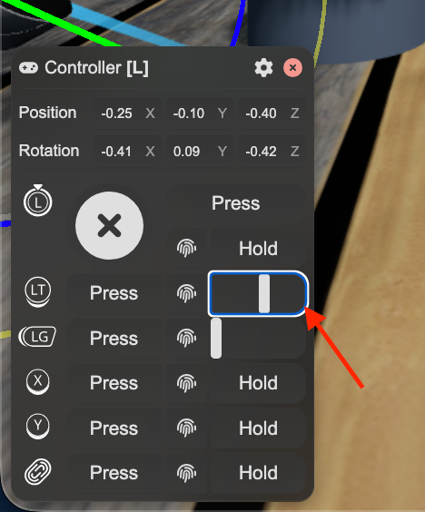
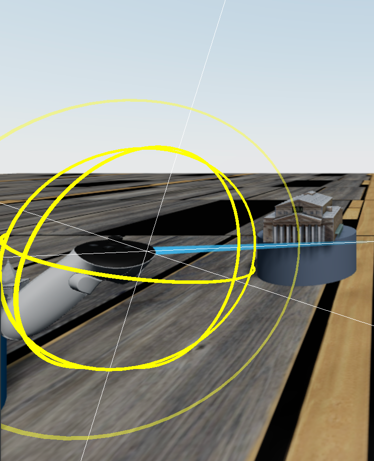

# WebXR 3D Gallery

Интерактивная 3D‑галерея на React и Three.js с поддержкой WebXR. Приложение отображает набор GLB‑экспонатов на пьедесталах, подсвечивает активные объекты, позволяет добавлять новые модели и взаимодействовать с ними как в обычном режиме, так и в VR.

## Реализованный функционал

- 3D‑сцена с полом, небом, туманом и настроенным освещением.
- Галерея GLB‑моделей на пьедесталах с автонормализацией размера.
- Подсветка объекта при наведении и выборе.
- Подсчёт полигонов для активной модели.
- Панель состояния: активный объект, число полигонов, общее количество объектов.
- Добавление случайного объекта перед камерой.
- Два режима взаимодействия: превью (мышь/тач) и VR (WebXR).
- VR‑интеракции: захват и перемещение объекта лучом, удаление по кнопке.

## Управление

### Превью (desktop / mobile)

- ЛКМ/касание + перетаскивание — осмотр сцены.
- Наведение — подсветка.
- ЛКМ/тап по объекту — выбор.
- Клик по пустому месту — снять выбор.

### VR (WebXR)

- Триггер/сжатие (LT) — захват объекта. Необходимо изменить положение ползунка(см. фото)
  
- Движение/поворот контроллера — перемещение объекта по полу. Необходимо нажать вблизи контроллера, чтобы появлись оси перещения, после чего взять фокус в тот момент, когда на экране появятся три белых линии(оси) для управления контролерам во всех 3х осях
  
- Кнопка **X** на левом контроллере — удалить активный объект (выбранный/подсвеченный/захваченный).

## Видео

Видео‑демонстрация. Если встроенный плеер GitHub не воспроизводит ролик, откройте его по прямой ссылке:
[https://disk.360.yandex.ru/i/ckUEuCvbhCnMlw](https://disk.360.yandex.ru/i/ckUEuCvbhCnMlw)

<video
controls
src="https://disk.360.yandex.ru/i/ckUEuCvbhCnMlw"
style="max-width: 100%; height: auto;"

> Ваш браузер не поддерживает воспроизведение видео в теге video.
> </video>

## Стек

- React 19
- Three.js
- @react-three/fiber / @react-three/drei
- @react-three/xr
- Vite + TypeScript

## Запуск проекта

1. Установить зависимости:

```bash
npm install
```

2. Запустить dev‑сервер:

```bash
npm run dev
```

3. Открыть адрес из консоли Vite (обычно http://localhost:5173).

Примечание: VR требует браузер с поддержкой WebXR и VR‑устройство. WebXR работает только в безопасном контексте (HTTPS или localhost).

## Дополнительно

- Сборка проекта: `npm run build`
- Локальный предпросмотр сборки: `npm run preview`
- Проверка линтером: `npm run lint`
